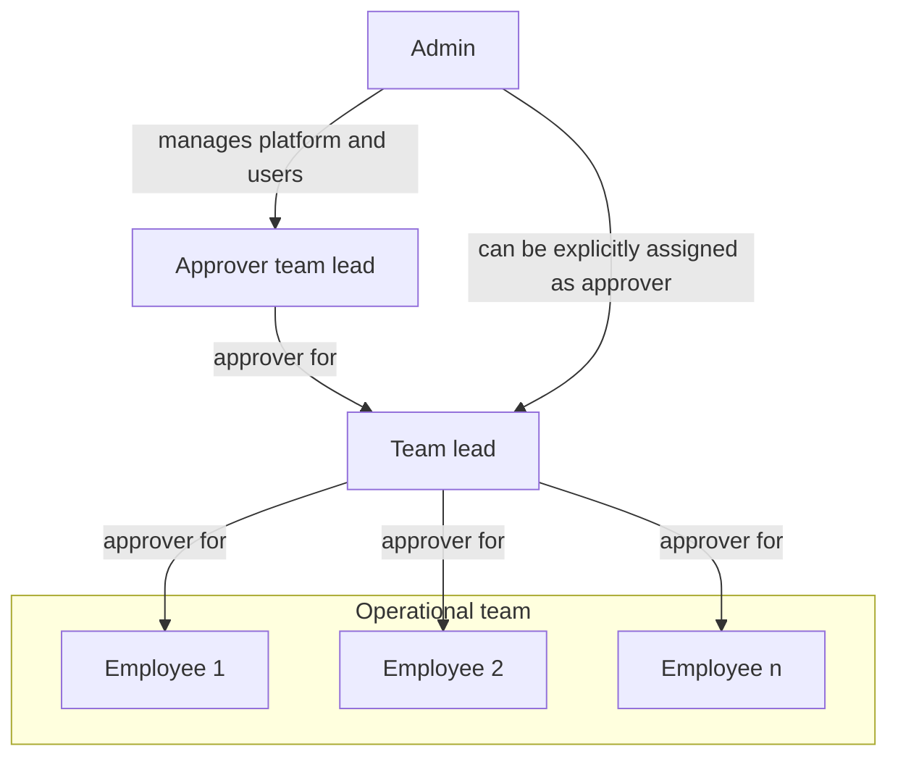
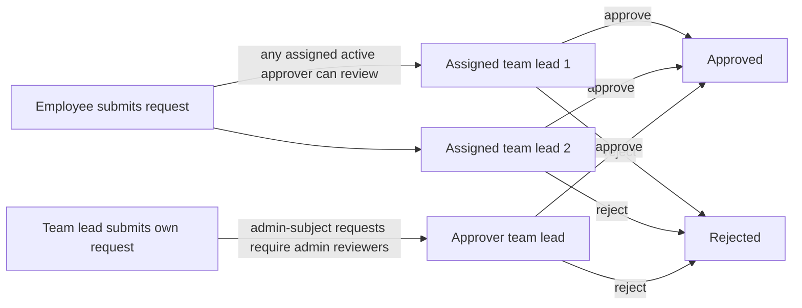

# Zerf User Guide

This guide explains how to use Zerf in daily work and how core workflow logic behaves.

Use this document if you are:

- an employee who needs a quick start,
- an approver who needs to review requests,
- an admin who needs to understand role and process behavior,
- anyone who wants clear answers about status logic, balances, and edge cases.

## Table of contents

- [Quick start](#quick-start)
  - [1. First login](#1-first-login)
  - [2. Your first work week](#2-your-first-work-week)
  - [3. If you need to correct submitted data](#3-if-you-need-to-correct-submitted-data)
- [Core concept: crediting vs. non-crediting entries](#core-concept-crediting-vs-non-crediting-entries)
  - [Key insight: workflow vs. work-math](#key-insight-workflow-vs-work-math)
  - [Practical examples](#practical-examples)
- [Roles and approval model](#roles-and-approval-model)
- [Timezone and date behavior](#timezone-and-date-behavior)
- [Time entry workflow](#time-entry-workflow)
  - [Status lifecycle](#status-lifecycle)
  - [Weekly process](#weekly-process)
  - [Time-entry summary tiles](#time-entry-summary-tiles)
  - [Understanding crediting vs. non-crediting entries](#understanding-crediting-vs-non-crediting-entries)
  - [Important workflow rule](#important-workflow-rule)
  - [Approval permissions and scope](#approval-permissions-and-scope)
- [Changes after submission](#changes-after-submission)
  - [Request edit (week level)](#request-edit-week-level)
- [Absence workflow](#absence-workflow)
  - [Status lifecycle](#status-lifecycle-1)
  - [Auto-approval](#auto-approval)
  - [Overlap rules](#overlap-rules)
- [Flextime logic](#flextime-logic)
  - [How daily targets are calculated](#how-daily-targets-are-calculated)
  - [What counts toward flextime actuals](#what-counts-toward-flextime-actuals)
  - [Automatic break deduction](#automatic-break-deduction)
- [Submission status indicator](#submission-status-indicator)
  - [How completeness is determined](#how-completeness-is-determined)
  - [Important: non-crediting entries affect completeness](#important-non-crediting-entries-affect-completeness)
- [Vacation balance and carryover logic](#vacation-balance-and-carryover-logic)
  - [Balance fields in the UI](#balance-fields-in-the-ui)
  - [Core formulas](#core-formulas)
  - [Which statuses affect carryover and available days](#which-statuses-affect-carryover-and-available-days)
  - [Carryover expiry behavior](#carryover-expiry-behavior)
  - [Cross-year vacation requests](#cross-year-vacation-requests)
  - [Worked examples](#worked-examples)
  - [Why this can feel strict](#why-this-can-feel-strict)
- [Notifications](#notifications)
  - [Employee receives notifications when](#employee-receives-notifications-when)
  - [Approver receives notifications when](#approver-receives-notifications-when)
  - [Exception: auto-approved submissions and reopen requests are silent](#exception-auto-approved-submissions-and-reopen-requests-are-silent)
  - [Who gets notified](#who-gets-notified)
  - [Important: non-crediting entries trigger reminders too](#important-non-crediting-entries-trigger-reminders-too)
  - [Monthly submission reminder](#monthly-submission-reminder)
  - [Weekly approval reminder](#weekly-approval-reminder)
  - [Reminder toggles (admin)](#reminder-toggles-admin)
  - [System error notifications (admin)](#system-error-notifications-admin)
  - [Notification timestamp display](#notification-timestamp-display)
- [Important edge case: sick leave with existing time entries](#important-edge-case-sick-leave-with-existing-time-entries)
- [Approval structure examples](#approval-structure-examples)
  - [Role organigram](#role-organigram)
  - [Example approval flow](#example-approval-flow)
  - [What explicit assignment means](#what-explicit-assignment-means)
- [Reporting behavior (important)](#reporting-behavior-important)
  - [Month and overtime/flextime math](#month-and-overtimeflextime-math)
  - [Category breakdown reports](#category-breakdown-reports)
  - [Team report scope](#team-report-scope)
- [Admin checklist for a correct setup](#admin-checklist-for-a-correct-setup)
- [FAQ](#faq)
  - [Why can my approver not see my entries?](#why-can-my-approver-not-see-my-entries)
  - [Why was my absence rejected even though dates were valid?](#why-was-my-absence-rejected-even-though-dates-were-valid)
  - [Why does my flextime increase on a sick day?](#why-does-my-flextime-increase-on-a-sick-day)
  - [Why does submission status show missing weeks even though current week is in progress?](#why-does-submission-status-show-missing-weeks-even-though-current-week-is-in-progress)
  - [Why don't the hours I booked today change my flextime balance?](#why-dont-the-hours-i-booked-today-change-my-flextime-balance)
- [Employee workflow reference](#employee-workflow-reference)
  - [Recording time entries](#recording-time-entries)
  - [Submitting a week](#submitting-a-week)
  - [Requesting a week reopen](#requesting-a-week-reopen)
  - [Absences: creating](#absences-creating)
  - [Absences: editing a pending absence](#absences-editing-a-pending-absence)
  - [Absences: cancelling](#absences-cancelling)
  - [Vacation balance](#vacation-balance)
- [Team lead workflow reference](#team-lead-workflow-reference)
  - [Scope of lead authority](#scope-of-lead-authority)
  - [Reviewing time entries (week level)](#reviewing-time-entries-week-level)
  - [Reviewing an absence](#reviewing-an-absence)
  - [Reviewing an absence cancellation](#reviewing-an-absence-cancellation)
  - [Reviewing a reopen request](#reviewing-a-reopen-request)
  - [Team settings: reopen policy](#team-settings-reopen-policy)
  - [Team settings: submission policy](#team-settings-submission-policy)
  - [Viewing team reports](#viewing-team-reports)
  - [Scoped assistant user management (optional)](#scoped-assistant-user-management-optional)
- [Admin workflow reference](#admin-workflow-reference)
  - [Reading the audit log](#reading-the-audit-log)
  - [Creating a user](#creating-a-user)
  - [Updating a user](#updating-a-user)
  - [Archiving a user](#archiving-a-user)
  - [Restoring an archived user](#restoring-an-archived-user)
  - [Deleting a user](#deleting-a-user)
  - [Resetting a password](#resetting-a-password)
  - [Managing approver assignments](#managing-approver-assignments)
  - [Direct correction of submitted or approved entries](#direct-correction-of-submitted-or-approved-entries)
  - [Managing annual leave](#managing-annual-leave)
  - [Revoking an approved absence](#revoking-an-approved-absence)
  - [System settings](#system-settings)
  - [Nextcloud Upload](#nextcloud-upload)
  - [Managing categories](#managing-categories)
  - [Managing holidays](#managing-holidays)
  - [Backup and restore](#backup-and-restore)
- [Status transition reference](#status-transition-reference)
  - [Time entry statuses](#time-entry-statuses)
  - [Absence statuses](#absence-statuses)
  - [Reopen request statuses](#reopen-request-statuses)
- [Security and access control](#security-and-access-control)
  - [Authentication](#authentication)
  - [Temporary passwords and forced password change](#temporary-passwords-and-forced-password-change)
  - [Role-based access control](#role-based-access-control)
  - [Pure-admin mode (tracks_time=false)](#pure-admin-mode-tracks_timefalse)
  - [Session invalidation](#session-invalidation)
  - [Audit trail](#audit-trail)
  - [Input validation and DoS prevention](#input-validation-and-dos-prevention)
  - [Information disclosure prevention](#information-disclosure-prevention)

## Quick start

### 1. First login

1. Open your Zerf URL and sign in with your account.
2. Check your profile settings (name, language, weekly hours).
3. Confirm that an approver is assigned if you are not an admin.

### 2. Your first work week

1. Create daily time entries as `Draft`.
2. Add absences if needed (vacation, sick leave, training, etc.).
3. At end of week, use `Submit Week`.
4. Track approval results and notifications.

### 3. If you need to correct submitted data

- Click `Request edit` on the affected week. Once your team lead approves
  (or auto-approval is enabled), every entry in that week becomes editable
  again.
- A submitted week is always handled as a single unit — individual entries
  inside it cannot be modified separately.

## Core concept: crediting vs. non-crediting entries

Zerf tracks two types of work time entries, and understanding the difference will help you use the system more effectively.

Every work category (like "Project work", "Team meeting", etc.) is configured as either **crediting** or **non-crediting**. This determines whether the hours count toward your work targets and flextime balance.

| Type | Examples | Counts toward targets? | Counts toward flextime? | Requires approval? |
| --- | --- | --- | --- | --- |
| **Crediting** | Project work, Client support, Sales | ✓ Yes | ✓ Yes | ✓ Yes |
| **Non-crediting** | Meetings, Training, Internal admin | ✗ No | ✗ No | ✓ Yes (same as all entries) |

### Key insight: workflow vs. work-math

- **Workflow** (submission, approval, reminders): All entries participate equally, whether crediting or non-crediting.
- **Work-math** (flextime, targets, reports): Only crediting entries count.

This means:

- You must submit both types of entries. Non-crediting entries do not skip the approval workflow.
- Your weekly completeness status includes both types. If you have unsubmitted non-crediting entries, your week is incomplete.
- Only crediting entry hours affect your flextime calculation and whether you hit your daily/monthly targets.
- Non-crediting entries are recorded for transparency and audit, but they do not impact your work metrics.

### Practical examples

**Example 1: Completeness check**
- You have 8h crediting work all week (submitted/approved).
- You have 2h team meetings (non-crediting, still in draft).
- Your week status: **Incomplete** — you must submit the meetings too.
- Once you submit them, your week is **Complete** and ready for reporting.

**Example 2: Flextime calculation**
- Your daily target: 8 hours
- You log: 6h crediting work + 2h training (non-crediting)
- Flextime delta: 6 − 8 = **−2 hours** (only the 6h crediting work counts)
- The 2h training is recorded but does not affect your flextime.

**Example 3: Reopen request**
- Your week has 8h crediting work and 2h meetings (both submitted).
- You request to reopen the week.
- Result: all submitted, approved, or rejected entries in the week are reset to draft and can be edited again.

If you are unsure which categories in your organization are crediting, ask your admin or check the category list in the Settings. Inactive categories remain visible to admins for maintenance, but they are hidden from normal time-entry forms.

## Roles and approval model

Zerf uses explicit approver assignments. Approvals and notifications are not
inferred from role alone.

- Employee: records time and absences, submits weeks, requests changes.
- Assistant: records time and absences like an employee, but has no fixed
  weekly target hours and no flextime account. An employee with zero weekly
  hours still follows the normal reminder and approval logic.
- Approver: a user who has been explicitly assigned to another user and is
	active.
- Admin: manages users, categories, holidays, settings, and can also be an
	approver if explicitly assigned.

Important rules:

- Every approval workflow is driven by explicit assignment.
- A user can have multiple approvers. If more than one active approver is
	assigned, all of them are treated as valid recipients and reviewers for that
	user's requests.
- Admin users do not automatically receive notifications just because they are
	admins. They only receive approval notifications when they are explicitly
	assigned.
- Non-admin approvers cannot act on admin users. Admin-subject requests are
	handled by admins only.
- Only active approvers are considered. Inactive users are ignored for routing
	and review.

This means the assignment list is the single source of truth for who gets asked
to review a request.

An admin can optionally grant non-admin team leads a narrow, additional
capability: creating and managing "Assistant" users assigned to them. This is
off by default and controlled by a single setting; see [Scoped assistant user
management (optional)](#scoped-assistant-user-management-optional) and [System
settings](#system-settings).

## Timezone and date behavior

Zerf uses one configurable application timezone for all business date logic.

What this means in practice:

- Admins can set the app timezone in settings (Settings → General, IANA zone, for example
	`Europe/Berlin`).
- "Today", current year/month boundaries, reminder scheduling dates, and
	date-based workflow checks are calculated in the configured app timezone.
- User-facing dates and timestamps in UI, emails, and notifications are
	formatted in the configured app timezone.
- End users do not need to configure a personal business timezone for workflow
	behavior; workflow date logic is consistent system-wide.

This prevents "wrong day" edge cases around midnight and daylight-saving
changes when users and server run in different timezones.

## Time entry workflow

### Status lifecycle

| Status | Meaning |
| --- | --- |
| Draft | Created by employee. Not yet in review. |
| Submitted | Week was submitted. Approvers can review. |
| Approved | Entry accepted. Included in reports and flextime logic. |
| Rejected | Entry rejected. Employee must resolve and resubmit when needed. |

Users with submission auto-approval enabled skip `Submitted` entirely: their
entries go directly from `Draft` to `Approved` on submit (see [Team settings:
submission policy](#team-settings-submission-policy)).

### Weekly process

1. Create daily draft entries.
2. Submit the full week with `Submit Week`.
3. Approver accepts or rejects the week in batch.
4. Approved entries remain valid unless the whole week is reopened via a new edit request.

A submitted week is treated atomically. Individual entries inside a submitted,
approved, or rejected week cannot be clicked or edited any more — the only way
to correct them is to reopen the whole week (see "Changes after submission").

### Time-entry summary tiles

In the weekly Time Entry view, the first summary tile always shows recorded
crediting hours for the current week (rejected entries are excluded).

- Display format: logged hours and target hours (for example `6.0h of 8.0h target`).
- Color logic:
  - red when logged hours are below the weekly target,
  - green when logged hours are equal to or above the weekly target.
- The `Status` tile remains workflow-only and uses the same value font size as
  the logged-hours tile for consistent readability.

### Understanding crediting vs. non-crediting entries

Each work category in Zerf is configured as either **crediting** or
**non-crediting**.

**Crediting entries** (for example project work, client support):

- count toward daily and monthly targets,
- affect flextime balances.

**Non-crediting entries** (for example meetings, training, internal admin):

- follow the same submission and approval workflow,
- do not change flextime or target-hour math.

### Important workflow rule

All entries participate in workflow equally:

- submission,
- approval/rejection,
- completeness checks,
- reminders,
- reopen workflows.

### Approval permissions and scope

- Non-admin approvers can review only users explicitly assigned to them.
- Non-admin approvers cannot manage admin-subject workflow items.
- Admins can review all users.

The same scope rule is applied across time entries, absences, reopen requests,
and lead-scoped team views.

## Changes after submission

A submitted week is locked at the week level. There is no per-entry edit
workflow: once you have submitted a week, clicking an individual time entry
does nothing. The only way to make corrections is to reopen the whole week.

### Request edit (week level)

- Use this whenever a submitted, approved, or rejected entry needs to be
  corrected — whether it is one entry or several.
- An approved reopen resets all submitted, approved, or rejected entries in
  that week back to `Draft`.
- Reopened entries become editable; once the corrections are done, submit the
  week again.
- If a week has no submitted, approved, or rejected entries, the edit request
  is rejected with a message that the week has no submitted, approved, or
  rejected entries.
- Reopen requests can be pending review or auto-approved, depending on the
  requester's configuration (see Settings → Team Settings → "Auto-approve edit requests").

## Absence workflow

### Status lifecycle

| Status | Meaning |
| --- | --- |
| Requested | Sent by employee, waiting for decision. |
| Approved | Accepted by approver. Covered workdays have target hours 0. |
| Rejected | Declined by approver. |
| Cancellation pending | Employee asked to cancel an approved absence. |
| Cancelled | Approved absence was cancelled. Daily target returns to normal rules. |

### Auto-approval

- Absence categories marked **Auto-approve past dates** (e.g. sick leave) with a start date on or before today are auto-approved.
  Your approvers receive an informational notice, in-app and by email (not an action request).
- Other absence types require explicit approval.

### Overlap rules

- A request must include at least one effective workday (not weekend-only, not holiday-only).
- An absence request can span at most 365 days (i.e., end_date - start_date ≤ 365).
- Requesting an absence that overlaps days with existing time entries is allowed; however, the approver will see the conflict and the approval will be blocked until the time entries are removed or rejected.
- Once an absence is in *requested* status, new time entries on the covered days are blocked (to prevent the conflict from worsening while approval is pending).
- If an approved absence covers a day that already has time entries, those entries remain and still count as worked time.

Review and privacy behavior:

- Non-admin approvers can approve/reject only direct-report absences for
	non-admin users.
- Admin-subject absences are handled by admins.
- Calendar visibility is strictly role-scoped:
	- Employees and assistants see only their own absences and time entries.
	- Team leads see their own data plus the absences and time entries of
		every user who has them assigned as approver (their direct reports,
		excluding admin subjects). For direct reports' time entries, the
		person's name is shown in the event detail.
	- Admins see all users' data regardless of approver assignments.
- **Calendar visibility is governed solely by the requester's scope**:
	admins see all absences, leads see their own plus their direct reports',
	and employees see only their own. There is no per-category carve-out —
	a category is either visible because the viewer's scope covers the
	owner, or it is not visible at all.
- Comments are always restricted to (a) the absence owner and (b) leads
	whose scope covers the owner, even though admins can see the
	underlying absence entry. This keeps personal context in the comment
	from leaking beyond the people who already handle the request.

Vacations and sick leave are checked against the employee's own work schedule.
A one-day request on a public holiday or on a non-working weekday does not
count as a valid absence day.

## Flextime logic

Flextime (positive or negative balance) is calculated as:

**Flextime = Actual work hours − Daily targets**

Only **crediting entries** count as actual work hours in this calculation. Non-crediting entries are recorded and approved like all others, but they do not contribute to your flextime.

**The flextime balance is calculated up to and including yesterday — today's
hours are not yet counted toward the balance.** This applies everywhere the
balance is shown (dashboard, reports, team overview, balance chart, exports)
and regardless of whether the days are inside a submitted or approved week.
Today's hours still appear in your time entries, the monthly logged-hours
tile, and category breakdowns; they only stop short of contributing to the
running balance until tomorrow.

Users with role `assistant` do not have a flextime account. This behavior is
role-based (not inferred from weekly hours). For assistants, flextime and
overtime reports return no rows and submission completeness for past weeks is
treated as complete.

### How daily targets are calculated

Daily target is the number of hours you are expected to work on a given day.

Daily target hours are `0` when:

- Day is a weekend (for your configured work schedule),
- Day is a public holiday,
- Day is covered by an approved absence (vacation, sick leave, training, etc.),
- Day is before your start date,
- Day is in the future.

Absences from categories with cost type `flextime` (e.g. flextime reduction) are the exception: they follow the absence workflow and block normal time entry creation on those days, but the daily work target is not removed. This lets the days reduce your flextime balance intentionally. To prevent the balance from going below the configured minimum (default 0 minutes; admin can override via the `flextime_min_balance_min` setting), the balance is checked TWICE: when you submit the request AND when the approver approves it. The check accounts for any other already-pending/approved flextime-cost absences you have so multiple requests that each individually fit cannot together breach the floor, and the approver's re-check catches the case where you spent balance between request and approval.

Otherwise, target is calculated as:

**Daily target = (Weekly hours ÷ Workdays per week) × (1 day)**

Example: If you work 40 hours per week over 5 days, your daily target is 8 hours.

### What counts toward flextime actuals

- **Approved crediting entries:** hours count fully.
- **Submitted crediting entries:** hours do NOT count in the official flextime actuals, but they are included in the Overtime overview tile balance as a projected total (see note below).
- **Draft crediting entries:** hours do NOT count.
- **Non-crediting entries (all statuses):** hours do NOT count, regardless of approval status.

**Overtime overview tile:** The balance shown in the `Overtime overview` tile on the dashboard includes both approved and submitted (pending approval) crediting hours filed up to and including yesterday. This gives you a projected total reflecting everything you have filed so far (today's hours are still excluded — see above). If there are no pending approvals, the displayed value equals the official approved balance. When submitted hours are pending, the sub-text shows the approved-only balance for reference.

Example flextime scenario:

- Your daily target: 8 hours
- Monday approved work entries (crediting): 7 hours → Flextime delta: −1 hour
- Monday team meeting (non-crediting): 1 hour → Does NOT affect flextime
- Monday total actual hours for flextime: 7 hours (only crediting counted)
- Your Monday flextime result: 7 − 8 = −1 hour

If your team meeting were crediting instead, the result would be: (7+1) − 8 = 0 hours flextime.

### Automatic break deduction

When the feature is enabled in Settings → General, Zerf silently deducts a configured number of break minutes from each day's credited work when consecutive work reaches or exceeds a configured threshold.

**How continuity is determined:**

- Crediting time entries are examined per day only. Work time does not carry over across midnight.
- Two entries are treated as one continuous block when one ends at the exact minute the next begins (zero gap). Even a one-minute gap between entries breaks continuity into separate blocks.
- Overlapping entries are merged into one block.

**Deduction logic:**

- Up to two break tiers can be configured. For each continuous block, only the **highest applicable tier** fires — the tiers are **not cumulative**.
  - Example: tier 1 = 6 h → 30 min; tier 2 = 9 h → 45 min. A 10-hour block deducts 45 min total, not 75 min.
- If a day has two separate long blocks (morning and afternoon each exceeding the threshold), each block is evaluated independently and triggers its own deduction.
- The deduction is applied to approved crediting time. It reduces credited hours in month reports, overtime, and the flextime balance.

**What is not affected:**

- The deduction is not labeled or shown in reports, team overviews, or CSV exports. It reduces the total silently.
- For the official flextime balance and reports, only approved entries are used in the deduction calculation. Draft and submitted entries do not affect the flextime account.
- Non-crediting entries are not considered when computing consecutive blocks.

**Visual indicator on the time tracking page:**

The time tracking page applies the break deduction as a preview for all non-rejected entries (including drafts and submitted entries) so you can see the impact before approval. The daily total shown next to each day already includes this preview deduction. This preview matches the deduction that will be applied to the flextime balance once entries are approved.

When a break is triggered, the entry block where the threshold is crossed displays a horizontal marker. Its vertical position reflects the exact moment within that entry when the threshold is reached, and its height is proportional to the deduction duration relative to the entry's length.

Example: threshold 6 hours, deduction 30 minutes. An employee books 3 hours of core work followed immediately by 4 hours of training (7 hours total, one continuous block). The threshold is crossed during the training block, 3 hours into it (6 total hours reached). The marker appears at three-quarters from the top of the training entry block, and its height corresponds to 30 minutes of the 4-hour entry (about 12.5 % of the block height).

**Configuration (Settings → General):**

| Setting | Description |
| --- | --- |
| Enable automatic break deduction | Enables or disables the feature. When disabled, all stored values are cleared. |
| Break threshold (hours) | Tier-1 minimum consecutive crediting work duration that triggers a break (must be greater than 0, up to 24 h). |
| Break deduction (minutes) | Tier-1 total minutes deducted when the threshold is reached (1–480 min). |
| Second threshold (hours) | Optional tier-2 threshold. Must be greater than tier-1. When a block reaches this duration, the tier-2 deduction replaces tier-1. |
| Second deduction (minutes) | Tier-2 total minutes deducted (1–480 min). This is the total, not additional — e.g. configure 45 min here, not 15 min, to achieve a 45-minute break at the tier-2 threshold. |

## Submission status indicator

The `Submissions` tile shows whether all required past weeks have been submitted and approved.

- **Scope:** from your start date up to and including the last complete week.
- **Current week is excluded** from this check (it is still ongoing).

### How completeness is determined

Completeness is checked at the **week level**, not the day level. It does not
matter how many days you booked or whether you reached your weekly target hours.
What counts is that you submitted the week.

A week is considered **complete** when:

- At least one entry in the week is submitted or approved (crediting or
  non-crediting), **and** no entry in the week is still in draft or rejected
  state, **or**
- The week has no entries at all and every contract workday is excused by an
  approved absence, a public holiday, or falls before your contract start date.
  (This covers e.g. full-vacation weeks.)

For users with role `assistant`, past-week completeness is always treated as
complete.

A week is considered **incomplete** when:

- Any entry anywhere in the week is still in draft or rejected state (the week
  has not been cleanly submitted), **or**
- The week has no entries and at least one contract workday is not excused.

### Important: non-crediting entries affect completeness

Non-crediting entries count toward the submission check just like crediting
entries. If you have a non-crediting entry in draft, your week remains
**incomplete** until you submit it.

**Example:**

- Monday–Friday: all crediting work entries submitted/approved
- Wednesday: one team meeting (non-crediting) still in draft
- Week status: **Incomplete** — Wednesday's draft blocks the whole week
- Once you submit Wednesday's meeting, the entire week becomes **Complete**
- Flextime calculation then includes Mon–Tue, Thu–Fri crediting entries only
  (the non-crediting meeting is not counted in flextime regardless)

States:

- `All submitted and approved` (green): every elapsed week has been submitted and all entries are approved (no pending approvals remaining).
- `All submitted (approvals pending)` (orange): every elapsed week has been submitted, but at least one entry is still waiting for approval.
- `Weeks missing` (orange): at least one elapsed week has missing or unfinished submissions.

## Vacation balance and carryover logic

This section explains exactly how vacation balances are calculated, including carryover from the previous year.

### Balance fields in the UI

| Field | Meaning |
| --- | --- |
| Annual entitlement | Configured annual leave for the selected year (after start-date pro-rating). |
| Carryover days | Unused vacation from previous year that can be transferred into selected year. |
| Carryover remaining | Portion of transferred carryover that is still unused. |
| Carryover expiry | Date when carryover becomes unusable (month and day configured by admin, applied to the selected year). |
| Already taken | Approved vacation days in the selected year that are already in the past (or up to today). |
| Approved upcoming | Approved vacation days in the selected year that are still in the future. |
| Requested | Vacation requests waiting for approval. Includes cancellation pending days. |
| Available | Total budget minus already taken, approved upcoming, and requested. |

### Core formulas

For selected year Y:

1. Annual entitlement Y:
- Uses the leave-day value configured for user and year Y.
- Proration is anchored on the user's hire date if one is set, otherwise on
  their start date (see "Creating a user"). If that anchor date falls within
  Y, entitlement is pro-rated from it.

2. Carryover days into Y:
- Start with previous year entitlement after pro-rating.
- Subtract previous year approved vacation usage.
- Never below zero.

In short: carryover equals any unused days from the previous year (never below zero).

3. Total usable budget in Y:
- If carryover has expired: only annual entitlement.
- If carryover has not expired: annual entitlement + carryover days.

4. Available days in Y:
- Available = total usable budget - already taken - approved upcoming - requested

### Which statuses affect carryover and available days

Vacation status impact:

- Approved:
	- Counts as usage for budget checks.
	- Split into already taken or approved upcoming depending on date.
- Requested:
	- Reserves budget and is counted in requested.
	- Not counted as already taken.
- Cancellation pending:
	- Still reserves budget and is counted in requested.
	- Reason: cancellation is not final until approver decision.
- Rejected or cancelled:
	- No budget impact.

Important distinction:

- Carryover source (how many days are transferred from previous year) uses previous-year approved usage only. Cancellation-pending days from the previous year do not reduce next year's carryover: while a cancellation is undecided we favor the user and assume the day may be returned. If the cancellation is later rejected, the day reverts to approved and the carryover recomputes downward on the next read.
- Current-year availability uses approved plus requested plus cancellation pending reservation.

### Carryover expiry behavior

The carryover expiry date is configured in Settings → General as a month and day (for example 03-31 for March 31).

- Carryover for a given year expires on that date within the year.
- After expiry, transferred carryover is not part of total usable budget.

Carryover remaining is consumed by approved taken days:

- With expiry date:
	- Only approved days taken up to min(expiry date, today) reduce carryover remaining.
- Without valid expiry date:
	- All already taken approved days reduce carryover remaining.

Approved upcoming days do not consume carryover remaining yet, because they are not taken yet.

### Cross-year vacation requests

If one vacation request spans two years, Zerf validates both years separately:

- Part inside start year is checked against start-year budget.
- Part inside end year is checked against end-year budget.
- Carryover into end year is derived from remaining start-year entitlement.

This prevents a request from being valid in one year but over budget in the other year.

### Worked examples

Example A: standard carryover

- 2026 entitlement: 30
- 2026 approved vacation used: 22
- Carryover into 2027: 8
- 2027 entitlement: 30
- 2027 total budget before expiry: 38

Example B: pending requests reserve budget

- Total budget: 38
- Already taken: 5
- Approved upcoming: 4
- Requested (pending): 3
- Available: 38 - 5 - 4 - 3 = 26

Example C: cancellation pending

- One approved upcoming day is moved to cancellation pending.
- Approved upcoming decreases by 1.
- Requested increases by 1.
- Available stays unchanged until cancellation is approved or rejected.

### Why this can feel strict

Users sometimes see that available days do not increase immediately after requesting cancellation. This is intentional.

- A cancellation request is not final.
- The day stays reserved until approver decision.
- This avoids overbooking the same budget window during pending review.

## Notifications

### Employee receives notifications when

- a week is approved or rejected (one notification per action, identifying the affected weeks),
- absence is approved or rejected,
- absence cancellation is approved or rejected,
- reopen request is approved or rejected,
- a monthly submission reminder is triggered on the configured deadline day (lists past weeks that are still not submitted).

If an admin approves or rejects their own item, Zerf records the audit event
and sends an in-app-only notification (no email) back to the same user.

### Approver receives notifications when

- a week is submitted (one notification identifying the submitted weeks),
- an absence request is submitted,
- a reopen request is submitted,
- a weekly approval reminder is triggered (pending items awaiting review).

### Exception: auto-approved submissions and reopen requests are silent

When a user has submission or reopen auto-approval enabled (see Team settings
below), the corresponding action is recorded in the audit log as usual, but
**no in-app notification and no email are sent to anyone** — neither the
requester nor their approvers. This is different from every other
auto-approval in Zerf (e.g. past-dated sick leave), which still notifies the
approver informationally; submission and reopen auto-approval are
intentionally silent end-to-end.

### Who gets notified

- Only explicitly assigned approvers receive approval notifications and reminders.
- If a user has multiple active approvers, each of them receives the same
	request notification.
- Admin notifications and reminders are sent based on explicit assignment.
- Inactive approvers are skipped.
- For admin-subject workflows, only admins can act on the request.

This also applies to reminder emails and in-app reminders: Zerf reminds the
users who are actually assigned, not all users with a privileged role.

### Pending approval notifications clear automatically

As soon as a request has been decided by any one approver (approved, rejected,
revoked, or the cancellation thereof), the related notification is marked as
read for every other approver in the same instant. This applies to:

- week submissions for time entries,
- absence requests and absence cancellation requests,
- reopen requests.

The notification row stays in each approver's notification history (and the
audit log keeps the full trail), but the item no longer shows up in the
unread badge or in the dashboard's "open requests" lists for anyone else. So
once a colleague has acted, you do not need to refresh or re-check whether
your action is still required.

### Important: non-crediting entries trigger reminders too

Because non-crediting entries participate in the full approval workflow:

- **Submission reminders** go to employees who have ANY incomplete entries (crediting or non-crediting).
  - If you have unsubmitted crediting work and unsubmitted non-crediting meetings, you receive the reminder.
  - If you have only unsubmitted non-crediting entries, you still receive the reminder (to complete the workflow).

- **Approval reminders** go to approvers when there are submitted entries awaiting their decision.
  - Approvers see and must review both crediting and non-crediting entries.
  - Approval reminders are triggered by any submitted entry type.

Duplicate reminders are automatically suppressed — you will not receive the same reminder twice for the same day.

### Monthly submission reminder

On the configured submission deadline day each month, every active user with weekly hours > 0 (employees and team leads alike) receives one reminder (in-app, plus email if SMTP is enabled) listing the past weeks that are not fully submitted up to that day. The current week is excluded.

The reminder is sent directly to the affected user, not to their approvers. Duplicate reminders for the same user and deadline day are suppressed.

**What triggers the reminder:**
- Any required workday in a past week not covered by a submitted/approved entry or an approved absence.
- Days with only draft or rejected entries count as incomplete.
- Non-crediting entries fully participate: a day covered only by an unsubmitted non-crediting entry keeps the week incomplete.

### Weekly approval reminder

Zerf can send a weekly reminder to approvers when submitted items are waiting
for review.

- Reminder day/time follows the configured app timezone.
- Recipients are explicit active assignees only.
- Duplicate reminders for the same day are suppressed.

**What triggers the reminder:**
- Any submitted (not approved/rejected) entries from any category type.
- Non-crediting entries are included: if an approver has pending non-crediting entries, the reminder is sent.

### Reminder toggles (admin)

Admins can manage reminder behavior in Settings → General:

- submission reminders enabled/disabled,
- approval reminders enabled/disabled.

These toggles control whether the corresponding reminder background task sends
notifications/emails.

### System error notifications (admin)

When a technical failure occurs — such as a database backup failure or a Nextcloud upload error — all active admins receive a **pinned** notification at the top of their notification panel. Pinned unread notifications are visually highlighted and float above regular notifications.

- Each failure class produces **at most one active notification** per admin. If the notification is dismissed and the failure recurs, it is raised again.
- A throttled **alert email** is sent alongside the in-app notification, at most once per failure class per calendar day.
- The notification is created both by the Rust application (for report PDF upload failures) and detected hourly from the database (for backup failures written directly by the backup container).

### Notification timestamp display

Notification and email timestamps shown to users are rendered in the configured
app timezone so users see consistent local business time.

## Important edge case: sick leave with existing time entries

If approved absence overlaps a day with recorded work:

- daily target becomes `0`,
- existing time entries still count as actual worked hours.

Result: the day can produce a positive flextime delta.

This is intentional. It supports cases like partial sick days where someone worked part of the day.

## Approval structure examples

### Role organigram



### Example approval flow



### What explicit assignment means

When an approver is assigned to a user:

- that approver receives the user's approval-related notifications,
- that approver can review the user's submitted requests,
- the user appears in that approver's visible team scope,
- the assignment must point to an active user.

When no approver is assigned:

- no approver notification route exists,
- no review queue entry is created for that relationship,
- non-admin users should be configured with at least one approver.

For admins, the assignment list matters for notifications. If an admin is
not explicitly assigned, they will not receive approval reminders or request
notifications just because they are an admin.

## Reporting behavior (important)

Zerf distinguishes between workflow coverage and work-credit math.

### Month and overtime/flextime math

- Work-credit calculations use only entries that count as work and match the
	relevant status rules (for example approved for actuals).
- Non-crediting entries remain visible in workflow but do not inflate worked
	hour balances.
- The flextime balance is always calculated up to and including yesterday;
	today is excluded everywhere the balance is displayed (dashboard, reports,
	team overview, balance chart, CSV/PDF exports).
- Flextime balance charts mark absences, public holidays, and weekends with
	colored background bars so non-working days are visible in the timeline.
	Today's data point is included on the chart axis but contributes zero to
	the running balance until tomorrow.

### Category breakdown reports

- Category breakdowns show all booked non-rejected time entries in scope (not only
	crediting categories).
- This gives a complete operational view of what was booked by category.
- Employees see their own breakdown. Leads and admins can view a team aggregate
  for active time-tracking users in their reporting scope.

### Team report scope

- Admins can see all active users who track time.
- Non-admin leads see themselves plus explicitly assigned direct reports.
- Non-admin leads do not see admin subjects in lead-scoped team reporting.
- Personal report endpoints (month, range, CSV export, categories, overtime,
	flextime) are available only for active users who track time. Pure-admin
	accounts and inactive users do not have reportable personal datasets.

## Admin checklist for a correct setup

Use this checklist after initial deployment or major configuration changes.

1. Set app timezone in settings (Settings → General).
2. Assign explicit active approvers for all non-admin users.
3. Review reminder toggles (submission and approval reminders).
4. Confirm holiday data is loaded for current/next year.
5. Validate one end-to-end flow:
	 employee submits week -> approver receives notification -> approver reviews.

If one step is missing (especially explicit approver assignment), approval
notifications and pending queues will not behave as expected.

## FAQ

### Why can my approver not see my entries?

Your week is likely still in `Draft`. Approvers only review after `Submit Week`.

### Why was my absence rejected even though dates were valid?

Common reasons:

- range contains no effective workday,
- non-sick absence overlaps existing time entries.

### Why does my flextime increase on a sick day?

Because approved absence sets target to `0`, and recorded work still counts as actual time.

### Why does submission status show missing weeks even though current week is in progress?

Current week is excluded. Missing status is based on incomplete past full weeks.

### Why don't the hours I booked today change my flextime balance?

The flextime balance is intentionally calculated up to and including yesterday
only. Today's hours move the balance starting tomorrow. This avoids a balance
that shifts up and down during the day as hours are logged. Your today entries
still appear in the time entry list and in the monthly logged-hours tile;
they simply do not contribute to the balance yet.

---

## Employee workflow reference

This section documents every action an employee can perform, with the exact
rules enforced by the system.

### Recording time entries

**Create a time entry**

A time entry requires a date, a start time, an end time, and a category. The
following rules apply:

- The date must be today or in the past (future dates are not allowed).
- The date must be on or after your employment start date.
- End time must be later than start time.
- When the date is today, end time must not be in the future.
- Total crediting hours on that day must not exceed 14 hours.
- The time range must not overlap with any existing non-rejected entry on the
  same day.
- The day must not already be covered by an approved non-sick absence. Sick
  leave does not block time entry creation; all other absence types do.

A new entry is always created in draft status.

**Edit a time entry**

Only `draft` entries can be edited directly. Submitted, approved, or rejected
entries are part of a locked week — to change them you must first reopen the
whole week via a reopen request (see below). The same validation rules as
creation apply.

**Delete a time entry**

Only `draft` entries can be deleted. Submitted, approved, or rejected entries
cannot be deleted directly; use a reopen request to make them editable first.

### Submitting a week

`Submit Week` transitions a set of draft entries to `submitted` so that
approvers can review them.

Rules:

- Only your own draft entries are submitted; entries in another status are skipped.
- Once submitted, entries are locked for direct editing.

After submission, all your explicitly assigned approvers receive a notification
identifying the submitted weeks by their week labels.

**Auto-approval:** If your team lead or admin has enabled auto-approval of
submissions for you (Settings → Team Settings → "Auto-approve submissions"), submitted
weeks skip the approval queue entirely and go straight to `approved`. This is
silent by design: neither you nor your approvers receive any notification or
email about it.

### Requesting a week reopen

`Request edit` (a "reopen request") is the only way to amend a week after
submission. There is no per-entry change-request workflow — the week is the
unit of approval.

Rules:

- The week must contain at least one submitted, approved, or rejected entry.
  A week that is entirely draft is already editable and cannot be reopened.
- You cannot submit a second reopen request for the same week while one is
  still pending.

**Auto-approval:** If your team lead or admin has enabled auto-approval for your
reopen requests, the reopen takes effect immediately without requiring approval.
This is silent by design: neither you nor your approvers receive any
notification or email about it.

**Manual approval path:** The request enters `pending` status and all your
assigned approvers are notified.

When a reopen is executed (either path), all submitted, approved, and rejected
entries in that week are atomically reset to `draft`.  You can then edit and
resubmit the week.

### Absences: creating

**Allowed absence kinds:**
Vacation, sick leave, training, special leave, unpaid leave, general absence, and flextime reduction.

**Rules that apply to all kinds:**

- End date must be on or after start date.
- The range must not exceed one year.
- The range must include at least one effective workday. An effective workday
  is a contract workday that is not a public holiday. A request covering only
  weekends or public holidays is not valid.
- Start date must be on or after your employment start date.
- Comment, if provided, must not exceed 2000 characters.

**Additional rules for vacation:**

- The vacation balance for all years covered by the request is validated at
  creation time. Insufficient balance blocks the request.

**Additional rules for sick leave:**

- Start date cannot be more than 30 days before today.
- If the start date is today or earlier: sick leave is **auto-approved** immediately.
  Your approvers receive an informational notice, in-app and by email (not an action request).
- If the start date is in the future: sick leave requires approval like any other absence.

**Overlap and time-entry conflict:**

- Any absence overlapping another existing absence is rejected.
- A non-sick absence (vacation, training, etc.) that overlaps days with
  existing time entries is rejected. Delete or move the conflicting entries
  first.
- Sick leave overlapping existing time entries is allowed. The daily target
  becomes 0 for covered workdays, but the existing entries still count as
  worked hours.

After creation, assigned approvers receive a notification if the absence
entered `requested` status.

### Absences: editing a pending absence

Only absences in `requested` status can be edited. Approved absences cannot be
edited; cancel and re-request instead.

- The absence kind cannot be changed to or from `sick`.
- All creation validation rules apply to the updated values.

If the updated absence remains in `requested` status, approvers are notified
of the change. If it transitions to `approved` (sick leave with start_date
today or earlier), approvers receive an auto-approval notice.

### Absences: cancelling

The cancellation path depends on the current absence status:

| Current status | Action | Effect |
| --- | --- | --- |
| `requested` | Cancel | Immediate: status becomes `cancelled`. Approvers notified that request was withdrawn. No approval needed. |
| `approved` | Cancel | Deferred: status becomes `cancellation_pending`. Approvers notified to review the cancellation. Budget still reserved. |

Only `requested` and `approved` absences can be cancelled. Already cancelled,
rejected, or cancellation-pending absences cannot be cancelled again.

### Vacation balance

Your vacation balance is visible in the leave overview. The balance fields are:

- **Annual entitlement**: configured leave days for the year, pro-rated if you
  started during the year.
- **Carryover days**: unused vacation days carried over from the previous year (never below zero).
- **Carryover expiry**: date after which carryover is no longer usable (configured by your admin).
- **Already taken**: approved vacation days that are today or in the past.
- **Approved upcoming**: approved vacation days that are in the future.
- **Requested**: days in `requested` or `cancellation_pending` status.
  Budget is still reserved.
- **Available**: total usable budget − already taken − approved upcoming −
  requested.

Cross-year requests are validated per year: days in year Y consume Y's budget,
days in year Y+1 consume Y+1's budget separately.

---

## Team lead workflow reference

Team leads (role `team_lead`) and admins both have lead privileges. Unless
otherwise noted, all lead actions below apply to both roles.

### Scope of lead authority

Non-admin team leads can only act on users who are explicitly assigned to them.
This applies to:

- Viewing the team list
- Reviewing time entries, absences, and reopen requests
- Team reporting

Admin users can see and act on all users.

**Self-review restriction:** Non-admin leads cannot approve or reject their
own time entries, absences, or reopen requests. Their own submitted entries
are not shown in the Dashboard approval queue. Admins may approve or reject
their own items, and their own submitted entries appear in the queue like
any other user's.

**Admin-subject rule:** Non-admin leads cannot act on items submitted by admin
users. Admin-subject requests require an admin reviewer.

### Reviewing time entries (week level)

Approve or reject submitted time entries. All approval and rejection operates
at the week level. The week is the primary reviewable unit; individual entries
within a week are handled in the background.

- For approve: only submitted entries for users within your scope are changed.
  Entries outside your scope or in a different status are skipped.
- For reject: a rejection reason is required. The reason applies to all rejected
  entries in the batch.
- Non-admin leads cannot approve or reject their own entries. Admins may approve
  their own entries.
- Non-admin leads can only act on their direct reports' entries.
- Employees receive one notification per approval or rejection, identifying
  the affected weeks. Admins who review their own entries receive an in-app
  notification only (no email).
- Entries from users with submission auto-approval enabled never reach this
  queue — they are approved at submission time, silently (see [Team settings:
  submission policy](#team-settings-submission-policy)).

### Reviewing an absence

Approve or reject an absence in `requested` status.

- You must be a team lead or admin.
- Non-admin leads can only act on direct reports' absences.
- Non-admin leads cannot approve/reject their own absence.
- Only `requested` absences can be approved or rejected.
- Rejection requires a reason (non-empty, max 2000 characters).

**Vacation re-validation at approval time:** When approving a vacation absence,
the system re-validates the vacation balance against the employee's current
entitlement. If another vacation was approved in the meantime that exhausted the
budget, the approval is blocked.

**Time-entry conflict check at approval:** For non-sick absences, the system
re-checks that no time entries exist on the covered days at approval time. If
entries were created after the request was submitted, the approval is blocked.

### Reviewing an absence cancellation

Approve or reject a `cancellation_pending` absence.

- You must be a team lead or admin.
- Non-admin leads can only act on direct reports' absences.
- Non-admin leads cannot act on their own absence.
- Only `cancellation_pending` absences can have their cancellation reviewed.

| Decision | Result | Employee notification |
| --- | --- | --- |
| Approve cancellation | Absence status → `cancelled`. Budget released. | Yes (unless self-action by admin) |
| Reject cancellation | Absence status → `approved` (restored). Budget still consumed. | Yes (unless self-action by admin) |

### Reviewing a reopen request

Approve or reject a `pending` reopen request.

- You must be a team lead or admin.
- Non-admin leads can only act if explicitly assigned as approver for the
  requesting user.
- Non-admin leads cannot approve or reject their own reopen request.
- Only pending reopen requests can be reviewed.
- A rejection reason is required for rejection.

On approval: the reopen is executed atomically — all submitted, approved, and
rejected entries in the week are reset to `draft`. The employee receives a
notification.

On rejection: the week remains unchanged. The employee receives a rejection
notification with the reason.

Auto-approved reopen requests (see below) never reach this review queue — the
reopen already happened at request time, silently.

### Team settings: reopen policy

Team leads and admins access these settings via Settings → Team Settings.

Team leads can enable or disable auto-approval of reopen requests for their
direct reports. Admins can set it for any user (including themselves).

Non-admin team leads cannot modify their own reopen policy — only their own
approver (a higher lead or admin) may grant them auto-approval. This prevents
a lead from bypassing their own approval chain.

- When enabled: that user's future reopen requests are auto-approved immediately.
- When disabled: reopen requests require manual approval.
- Changes are recorded in the audit log.
- Auto-approval is silent: no notification or email is sent to the requester
  or to their approvers (see [Notifications](#notifications)).

### Team settings: submission policy

Team leads can enable or disable auto-approval of timesheet submissions for
their direct reports. Admins can set it for any user (including themselves).
This is an independent setting from the reopen policy above — a user can have
either, both, or neither enabled.

The same self-service restriction applies: non-admin team leads cannot modify
their own submission policy.

- When enabled: that user's submitted weeks skip the `submitted` status and go
  straight to `approved`. The system records the user themselves as reviewer.
- When disabled (default): submissions require manual approval as usual.
- Changes are recorded in the audit log.
- Auto-approval is silent: no notification or email is sent to the requester
  or to their approvers (see [Notifications](#notifications)).

### Viewing team reports

Team leads can access team-scoped reports covering their direct reports plus
themselves.

- Report date ranges are validated: from must be ≤ to, and the date span must
  not exceed 366 days.
- Non-admin leads see only users explicitly assigned to them (plus themselves).
  Admin users are not visible in non-admin lead team reports.
- Admins see all active users who track time.

### Scoped assistant user management (optional)

An admin can enable **Allow team leads to create assistant users** in Settings
→ General (see [System settings](#system-settings)). This is off by default.

When enabled, every non-admin team lead gets an additional **Users** tab under
Settings, scoped strictly to their own assigned users:

- The list shows everyone assigned to the lead as approver, plus the lead
  themselves — including archived direct reports (unlike every other
  lead-facing list, which only shows active team members; this is needed so a
  lead can find and restore an assistant they previously archived). For
  anyone who is **not** an "Assistant" (including the lead's own row), only
  the name is shown; no other field is sent by the server, and no action is
  available.
- Only users with role "Assistant" who are assigned to the lead can be viewed
  in detail, edited, archived, or restored.
- There is no delete action here. A team lead can never delete a user — only
  an admin can, via the regular Users tab.
- The **Add User** button only lets the lead create a new "Assistant" user.
  The role field is fixed and cannot be changed, and the new user's approver is
  always the creating lead — no other role or approver can be chosen.
- Admins are unaffected: they continue to use the full Users tab and can
  create, manage, or delete users with any role, as described under [Admin
  workflow reference](#admin-workflow-reference).

This is enforced by the backend, not just hidden in the UI: every action a
non-admin lead can perform here is re-validated against the assigned-assistant
scope on the server, regardless of what the client sends (see [Security and
access control](#security-and-access-control)).

---

## Admin workflow reference

Admins have all team lead privileges plus exclusive access to user management,
system settings, and sensitive operations.

### Reading the audit log

- Audit rows are shown in a human-readable format (for example names, date
  ranges, category names, or setting keys) instead of raw field dumps.
- Time-entry audit events are grouped by week and action. This reflects the
  product workflow, where submitted weeks are handled as one unit rather than
  as separate per-day operations.

### Creating a user

Creating a user requires admin role.

Required information:

- Role (employee, assistant, team lead, or admin)
- Email address (must be unique)
- First and last name (the combination must be unique)
- Weekly hours and workdays per week
- Base annual leave days, plus leave days for the current and next year
  (overrides; see [Managing annual leave](#managing-annual-leave))
- Employment start date

Role-specific rules:

- Assistants must have zero weekly hours and no overtime start balance. The
  corresponding fields are hidden in the form.
- When the assistant role is selected, all three leave-day fields are reset to
  0. This is intentional: under German law, Minijob (assistant) leave
  entitlement is derived from the number of days actually worked, which varies
  per person and per year. A pre-filled org-wide default would be misleading.
  Enter the correct entitlement for each year manually. If you switch back to
  a different role without saving, the previous leave values are restored.

Optional: an initial flextime balance to carry in from before the user was
created in the system.

Optional: a hire date — the date the person actually joined the company, if it
differs from their start date in Zerf. This matters when introducing Zerf to an
existing team: someone who already worked the full year before adopting Zerf
should see their full annual leave entitlement, not one pro-rated from the day
they started using Zerf. Set the hire date to their real employment start, and
their leave entitlement is pro-rated from that date instead. Leave it empty to
pro-rate from the start date, which is correct when employment and Zerf usage
begin on the same day.

Optional: one or more approvers to assign to the new user.

Optional: which time categories and absence categories the new user can use.
The creation form shows both lists pre-checked (every existing category
enabled, the default), so deselecting one is the only action needed to
restrict it. See [Managing categories](#managing-categories) for how access
is adjusted later, after the user already exists.

A temporary password is generated automatically. The user must change it on
first login. A registration email with the temporary password is sent if
email delivery is configured.

After creation, assign at least one active approver for non-admin users so that
approval routing works.

### Updating a user

Only provided fields are changed when updating a user. The same rules as
creation apply to each field.

**Guards to prevent accidental lockout:**

- An admin cannot set their own role to a non-admin value.
- Removing admin rights from a user requires at least 2 active admins
  remaining after the change.
- A user who still has direct reports assigned cannot have their role changed
  to a non-approver role. Reassign those users first.
- A user who is the sole approver for admin users cannot be downgraded to a
  role that cannot approve admin-subject requests.

When a user's role is changed, they are signed out immediately.

### Archiving a user

When a user has historical data (time entries, absences, or requests), the
system blocks permanent deletion and requires archiving instead. Archiving is
a soft removal that preserves all history while preventing the user from
logging in and hiding them from active lists.

**Location:** Settings > Users > select a user > Archive.

What archiving does:

- The user can no longer log in; any active sessions end immediately.
- The user disappears from the normal user list, approver pickers, team
  reports, and dashboards.
- All historical time entries, approved absences, and audit records are kept.
- All pending absence requests and pending reopen requests owned by the user
  are auto-rejected with the reason "User account archived."
- Already-approved absences (including future ones) are preserved.

Guards:

- Cannot archive yourself.
- Cannot archive the last active admin.
- If the user is currently listed as an approver for any active users, you
  must provide a replacement approver for each of those users in the same
  request. The archive is rejected unless every dependent user has a valid
  replacement assigned.

**Viewing archived users:** Settings > Users. The archived accounts are shown
in a separate "Archived Users" list below the active users on the same page.
Each row shows the user's name, role, and the date they were archived.

### Restoring an archived user

Restore brings an archived user back as an active account.

**Location:** Settings > Users > Archived Users list > select a user > Restore.

Restore behavior:

- The user becomes active again and can log in.
- `must_change_password` is set to true, so the user is forced to set a new
  password on first login.
- Approver assignments must be provided as part of the restore request; the
  user will have no approvers until they are set here.
- Optionally, a new start date can be supplied. This resets the start date
  used for flextime and balance calculations, which avoids accumulating a
  flextime gap for the period the user was archived. If no new start date is
  given, the original start date is kept.
- Historical data created before archiving is unchanged.

### Deleting a user

Permanent deletion removes all user data (entries, absences, requests, leave
records).

If the user has any historical time data, deletion is blocked and the error
message instructs you to use archiving instead.

Guards:

- Cannot delete yourself.
- Cannot delete the last active admin.
- Cannot delete a user who is still listed as an approver for active users.

There is no undo. Use archiving if you want to preserve history.

### Resetting a password

Resets the password for any active user.

- Only active users can have their password reset.
- A new temporary password is generated automatically.
- The user is required to change it on next login.
- All existing sessions for that user end immediately.
- When SMTP is configured, the user receives an email with the new temporary
  password. When SMTP is not configured, the admin must deliver the password
  to the user manually.

### Managing approver assignments

The approver list for a user controls who receives notifications and can
review that user's requests.

Rules for valid approvers:

- The approver must be an active user.
- The approver must have the team lead or admin role.
- Non-admin approvers cannot review admin users (even if assigned). Only
  admins can act on admin-subject requests.

When an approver is removed, the change takes effect immediately for future
requests. Pending requests that were already routed are not re-routed;
previously notified approvers can still act on them.

Non-admin users without an assigned approver cannot submit time entries,
absence requests, or reopen requests.

### Direct correction of submitted or approved entries

Admins can directly edit a submitted or approved time entry that belongs to
another user, without going through the reopen workflow. This is the admin
correction path.

Rules:

- The admin must be a different user from the entry owner (not editing their own entry).
- Entry status must be submitted or approved.
- The same validation rules as time entry creation apply.

Admins editing their *own* submitted or approved entries must instead go through
the regular reopen workflow — the admin correction path only applies to other
users' entries.

### Managing annual leave

Every user has a base annual leave entitlement (days/year), plus optional
per-year overrides:

- **Base annual leave days**: the user's standing entitlement, used for any
  year that has no explicit override. Required when creating a user — the
  field is pre-filled with the org-wide default (configured in
  [System settings](#system-settings)) but can be changed, for example when a
  special agreement was made with the employee.
- **Per-year overrides**: explicit leave days for a specific year (currently
  the user dialog exposes the current and next year). When set, the override
  takes precedence over the base value for that year only.
- For any other year, the base annual leave days value applies.
- Valid range: 0 to 366 days, for both the base value and overrides.
- **Assistants (Minijob)**: leave entitlement must be set manually each year
  because it is calculated from the actual number of days worked, which
  changes from year to year. All leave fields default to 0 when the assistant
  role is selected. Update the current-year and next-year overrides each
  January once the number of worked days for the previous year is known.
- Changes take effect immediately for balance calculations. If you reduce a
  user's entitlement after they have already used vacation, their available
  balance may go negative.
- When onboarding someone who already worked for the company before adopting
  Zerf, set their hire date (in the user's edit dialog) to their real
  employment start. This anchors leave proration on that date instead of their
  (later) Zerf start date, so they see their full entitlement rather than one
  wrongly pro-rated from when they started using Zerf.

### Revoking an approved absence

Admins can forcibly cancel an approved absence (for example, to fix a mistaken
approval).

- Only approved absences can be revoked.
- The absence is cancelled and the absence owner receives a notification
  (unless the admin is revoking their own absence).
- Budget freed by the revocation is reflected immediately in the balance
  calculation.

Revoke is distinct from cancellation: employees request cancellation;
admins revoke.

### System settings

Admins configure system-wide behavior in the Settings panel (Settings → General):

| Setting | Description |
| --- | --- |
| App timezone | Timezone name (e.g. `Europe/Berlin`). All date logic uses this timezone. |
| Carryover expiry | Vacation carryover from the previous year expires on this date each year (enter as month-day, e.g. 03-31). Defaults to 03-31 until explicitly changed; the field cannot be cleared to disable expiry entirely. |
| Submission deadline day | Day of the month (1–28) when the monthly submission reminder is sent. |
| Submission reminders enabled | Enable or disable the monthly submission reminder. |
| Approval reminders enabled | Enable or disable the weekly approval reminder. |
| Automatic break deduction | When enabled, deducts a configured break from each day where consecutive crediting work meets or exceeds a threshold. See [Automatic break deduction](#automatic-break-deduction). |
| SMTP configuration | Server, port, and credentials for outgoing email. Required for registration emails and email reminders. |
| Public URL | Used to construct login links in registration emails. |
| Nextcloud Upload | Configure automatic upload of encrypted DB backups and monthly timesheet PDFs to a Nextcloud public share. See [Nextcloud Upload](#nextcloud-upload). |
| Allow team leads to create assistant users | Off by default. Only an admin can change it. When on, non-admin team leads get a scoped Users tab limited to creating/managing "Assistant" users assigned to them. See [Scoped assistant user management (optional)](#scoped-assistant-user-management-optional). |

### Nextcloud Upload

Zerf can automatically upload two types of files to Nextcloud shared folders using public share links.

#### DB Backup Upload

When enabled, the backup container uploads each encrypted `.dump.enc` file to a Nextcloud public share immediately after it is created.

| Setting | Description |
| --- | --- |
| Enable DB backup upload | Activates the upload step in the backup container. |
| Share link | A Nextcloud public share URL in the form `https://cloud.example.com/s/<token>`. Only `https` links are accepted. |
| Share password | Optional password protecting the share. Stored securely; never returned by the API. |
| Backup interval (days) | How often the backup container runs a backup cycle. Default: 1 (daily). Changes take effect on the next cycle. |

The backup container tracks the last successful backup time in the database. This timestamp survives container restarts, so the interval is always measured from the last actual backup rather than from container start time.

The **10 most recent** local backup files are kept in the backup volume; older ones are deleted automatically after each successful backup. Uploaded files in Nextcloud are **not** deleted automatically — manage the shared folder manually to avoid unlimited growth.

The backup file is AES-256-CBC encrypted before upload, so a compromised share link does not expose plaintext data.

If a backup fails, all active admins receive a pinned in-app notification and a throttled alert email (at most one email per day per failure class). The notification is automatically re-raised if it was previously dismissed and the failure recurs.

#### Report PDF Upload

When enabled, Zerf queues an individual timesheet PDF for each employee on a configurable day each month. Each PDF covers the **previous calendar month**. Employees who have not yet submitted all their weeks are uploaded automatically on the next daily check — late submitters are caught up without manual intervention. Employees who were archived after the period ended are included for archive correctness.

| Setting | Description |
| --- | --- |
| Enable report PDF upload | Activates the monthly automatic upload. |
| Share link | A Nextcloud public share URL. Only `https` links are accepted. |
| Share password | Optional password protecting the share. |
| Upload day of month (1–28) | The day of the month on which the previous month's PDFs are queued. Default: 5. Set this after your team's submission deadline to maximise how many employees are already submitted when the queue is first processed. |

**Upload now** queues the previous month's PDFs for all employees immediately and uploads those who are already fully submitted. Employees who are not yet submitted are uploaded on subsequent daily checks. This does not prevent the scheduled monthly run from processing remaining entries.

If an upload fails, all active admins receive a pinned in-app notification and a throttled alert email (at most one email per day). The scheduled upload retries automatically on the next daily check.

### Managing categories

#### Time categories

Categories define what employees can book time against.

- Each category has a name and a crediting flag.
- Inactive categories are hidden from time entry forms but remain visible to
  admins for maintenance.
- A category must be active to be used in a new time entry.
- Deleting a category with existing time entries is not possible; deactivate
  instead.
- Each category can also be enabled or disabled per employee: editing a
  category shows a table of all employees with a checkbox per row. Only
  checked employees can see and use the category in the time-entry form. New
  categories default to enabled for every employee; new employees default to
  every existing category. Disabling a category for an employee only blocks
  *new* entries — their existing time entries in that category are
  unaffected, and reports/exports are unchanged.

#### Absence categories

Absence categories define what types of absences employees can request. Each category has two behavior fields:

| Field | Effect |
| --- | --- |
| **Cost type** | A single 3-state field that determines the balance impact of approved days. `none` — no balance impact (e.g. unpaid leave, general absence): the day is removed from the daily work target but neither annual leave nor flextime is debited. `vacation` — deducts from the employee's annual leave balance, honouring per-year carryover and expiry rules. `flextime` — keeps the daily work target intact so the absence costs flextime balance. The flextime balance is checked at BOTH request and approval time against the configured floor (default 0 minutes; admin can override via the `flextime_min_balance_min` setting); the check accounts for other already-pending/approved flextime-cost absences so multiple requests that each individually fit cannot together breach the floor, and the approver's re-check catches the case where the user spent balance between request and approval. |
| **Auto-approve past dates (sick-like)** | Absences with a start date on or before today are approved automatically. Approvers receive an informational notice, in-app and by email. This flag also disables the time-entry conflict check at creation, so partial-day overlaps are allowed (e.g. employee worked the morning and then called in sick). |

Constraints:
- A category slug is auto-generated from the name and must be unique. Existing absences are not affected when a category is deactivated or renamed.
- Inactive categories are hidden from the absence request dialog but remain attached to existing absence records.
- Changing the cost type of an absence (e.g. from a vacation category to a flextime category) after submission is not allowed. Cancel the existing request and re-submit with the correct category.
- Once a category has at least one referencing absence (any status), the behavior fields (**Cost type** and **Auto-approve past dates**) are locked. Toggling them would retroactively change the financial or approval meaning of existing rows — past balance recomputations would suddenly debit or credit different ledgers and approval workflow guards would relax or tighten without the affected employees seeing it. To change a field, deactivate the existing category and create a new one with the desired settings. Cosmetic changes (name, color, sort order, active flag) are always allowed.
- Like time categories, each absence category can be enabled or disabled per
  employee from the same edit dialog. Only checked employees can request the
  category going forward; existing absences already in that category are
  unaffected.

### Managing holidays

Holidays define public holidays that are excluded from:

- Absence effective-workday checks (a date range spanning only holidays
  contains no effective workday).
- Submission-completeness checks (holidays are not required workdays).
- Submission-reminder unsubmitted-week detection.

Holidays are date-scoped. Load holiday data for the current and next year to
ensure all checks work correctly into the near future.
Auto-imported holidays are compared with the configured country/region source
when Zerf ensures a year, so missing or changed imported holidays are refreshed
without removing manually added holidays.

### Backup and restore

Scheduled backups capture a full snapshot of the database. Each backup includes
version metadata so that the correct application revision can be matched when
restoring. Consult your deployment documentation for backup scheduling and
restore procedures.

---

## Status transition reference

### Time entry statuses

```
draft ──[submit]──> submitted ──[approve]──> approved
                          └──[reject]───> rejected

rejected ──[reopen approved]──> draft
submitted ──[reopen approved]──> draft
approved ──[reopen approved]──> draft
```

### Absence statuses

```
(creation)
  sick (start ≤ today) ──> approved (auto)
  other / future sick  ──> requested

requested ──[approve]──────────────> approved
requested ──[reject]───────────────> rejected
requested ──[cancel by employee]───> cancelled

approved  ──[cancel by employee]───> cancellation_pending
                                          ├─[approve cancellation]──> cancelled
                                          └─[reject cancellation]───> approved
approved  ──[revoke by admin]───────> cancelled
```

### Reopen request statuses

```
(creation)
  reopen auto-approval enabled --> auto_approved (week immediately reopened, silent)
  otherwise                    --> pending

pending ──[approve]──> approved
pending ──[reject]───> rejected
```

`approved`, `auto_approved`, and `rejected` are terminal for the request itself
(the week's *entries* are what move back to `draft` when the reopen executes —
see [Time entry statuses](#time-entry-statuses) above).

## Security and access control

### Authentication

- Sessions use SHA-256 hashed tokens stored server-side with absolute (168 h)
  and idle (8 h) timeouts enforced at the middleware level.
- Session cookies are `HttpOnly`, `SameSite=Strict`, and `Secure` (when
  configured) to prevent XSS and CSRF token theft.
- CSRF protection uses a double-submit pattern: every state-changing request
  must include an `X-CSRF-Token` header that matches the server-stored session
  token. Origin/Referer headers are additionally validated.
- Login is rate-limited: after 5 failed attempts within 15 minutes the account
  is temporarily locked. Generic error messages prevent email enumeration.
- Password reset tokens are single-use, SHA-256 hashed, and expire after 1 h.
  Inactive accounts cannot request password resets.

### Temporary passwords and forced password change

- When an admin resets a user's password, the system issues a one-time
  temporary credential, marks the account with `must_change_password`, and
  sends the new password to the user via email (when SMTP is configured).
- Until the password is changed, the backend middleware blocks **all** API
  endpoints except `/auth/me`, `/auth/password`, `/auth/logout`,
  `/auth/preferences`, and `/settings/public`. This prevents temporary
  credentials from being used to access or modify any sensitive data.
- The frontend enforces the same restriction via route-level redirects.

### Role-based access control

- **Admin** – full access to all users, settings, and data.
- **Team lead** – can view/approve only for users explicitly assigned to them
  via the approver chain. Cannot view or act on admin-subject data.
- **Employee** – can only access their own time entries, absences, and reports.
- **Assistant** – same as employee but excluded from flextime/overtime and
  dashboard.

Non-admin team leads are prevented from:

- Viewing or approving time entries / absences for admin-role users.
- Accessing users not in their direct report list.
- Approving their own submissions (self-approval prevention).

**Scoped assistant management endpoints (`/team-users*`):** when a non-admin
team lead is granted this capability (see [Scoped assistant user management
(optional)](#scoped-assistant-user-management-optional)), every request is
re-validated server-side, independent of what the client sends:

- The admin setting must be enabled, or every `/team-users*` request is
  rejected.
- List results only ever include the requester's own assigned users
  (active or not); for anyone who is not an "Assistant" the server omits
  every field except the name — there is no payload to leak even if the
  frontend had a bug.
- Create always forces role `assistant` and approver = the requesting lead,
  ignoring any role or approver value sent by the client.
- Get/update require the target to be both a direct report of the requester
  (active or not) **and** role `assistant`; anyone else (including a
  different lead's assistant, or the requester's own account) is rejected
  with `403 Forbidden`.
- There is no delete route under `/team-users*` at all — a non-admin lead
  can archive and restore an assigned assistant via the dedicated
  `/team-users/{id}/archive` and `/team-users/{id}/restore` endpoints,
  but can never delete one.
- Admins are unaffected and always use the regular `/users*` endpoints.

### Pure-admin mode (tracks_time=false)

- Admins with `tracks_time=false` cannot create, view, or export their own
  time entries, absences, or reports.
- They retain full access to team management, approval workflows, the calendar,
  and the Settings panel.
- The navigation bar automatically hides Time and Absences links for these
  accounts.
- The Calendar remains accessible since pure-admins need team schedule
  visibility for coordination.
- Report endpoints return Forbidden for targets with `tracks_time=false` or
  inactive status.
- **Disabling time tracking preserves all existing data.** Time entries,
  absences, and reopen requests are never deleted when `tracks_time` is set to
  `false`. The rows are retained immutably in the database but are silently
  excluded from all team views, approval queues, reminder notifications, and
  calculations. This mirrors how archived users are handled.

### Session invalidation

Sessions are automatically destroyed when:

- A user's role is changed.
- A user is archived or deleted (cascade on delete).
- A user changes their password (all other sessions are killed).
- An admin resets a user's password.
- A user logs out (all sessions for that user are killed).

### Audit trail

All significant administrative and approval actions are logged to the audit
table, including:

- User creation, update, archive, restore, and deletion.
- Password resets.
- Time entry status transitions (submit, approve, reject, reopen, and silent
  auto-approval on submit).
- Absence creation, approval, rejection, revocation, and cancellation.
- Admin settings changes (language, timezone, country, region).
- SMTP configuration changes.
- Team settings modifications (allow_reopen_without_approval,
  allow_submission_without_approval).

### Input validation and DoS prevention

- Date range queries are limited to a maximum of 366 days.
- Year parameters are bounded to 1970–2100.
- Batch operations (submit, approve, reject) are limited to 500 entries.
- Status filter parameters are validated against known values.
- Comments are limited to 2 000 characters.
- CSV exports include formula-injection guards (leading `=`, `+`, `-`, `@`,
  tab, or CR are prefixed with a single-quote).

### Information disclosure prevention

- Password hashes are never serialized in API responses.
- SMTP passwords are never returned; only a boolean `smtp_password_set`
  indicates whether one is configured.
- Absence and calendar visibility has no per-category masking (see
  [Overlap rules](#overlap-rules) above): if your scope doesn't cover a user
  at all, you see nothing about them; if it does (your own data, your direct
  report's, or any user's as an admin), you see the real kind, comment, and
  category — never a redacted placeholder.
